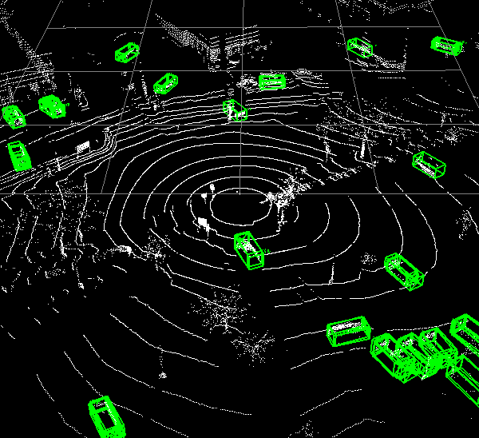
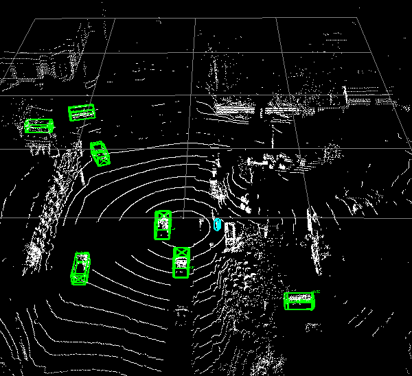
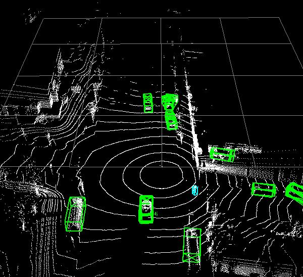

# OpenPCDet for LiDAR-Based Object Detection on V2V4Real Dataset

This repository is an adapted version of the original [OpenPCDet](https://arxiv.org/abs/1812.04244) project. Our enhancements include customized configuration files and utility scripts to enable training on the custom [V2V4Real](https://github.com/ucla-mobility/V2V4Real) dataset using the PV_RCNN model.

## Prerequisites
1. Follow the official [installation guide](https://github.com/open-mmlab/OpenPCDet/blob/master/docs/INSTALL.md) to install OpenPCDet.
2. Go through the [Custom Dataset Tutorial](https://github.com/open-mmlab/OpenPCDet/blob/master/docs/CUSTOM_DATASET_TUTORIAL.md) to understand the steps involved.

## 1. Data Preparation
1. Download the V2V4Real Dataset in the Kitti format. Detailed information about the dataset is available [here](https://mobility-lab.seas.ucla.edu/v2v4real/).

    The `labels_kitti` directory contains object labels and their respective 3D box coordinates. Below is an example:
    ```
    [
    {
        "obj_attr": "static",
        "obj_id": "1",
        "obj_type": "Car",
        "psr": {
        "position": {
            "x": -29.00726474921521,
            "y": -11.374487037642584,
            "z": -0.49037795901298487
        },
        "rotation": {
            "x": 0,
            "y": 0,
            "z": 3.036872898470133
        },
        "scale": {
            "x": 4.347834100224233,
            "y": 1.7882106094714172,
            "z": 1.621284008026123
        }
        },
        "ass_id": -1
    }
    ]
    ```

2. Convert the `.json` annotation files into the `.txt` format required by the model. The format should be as follows:
    ```
    # format: [x y z dx dy dz heading_angle category_name]
    1.50 1.46 0.10 5.12 1.85 4.13 1.56 Vehicle
    5.54 0.57 0.41 1.08 0.74 1.95 1.57 Pedestrian
    ```

    To automate this conversion, run the following script:
    ```
    python scripts/convert_json_to_txt.py -s /path/to/source -c tesla -t /path/to/txt_target -p /path/to/pcd_target
    ```
    You can also run the above multiple times for multiple source directory to save in the same target directory. It will make sure the new filenames are added to avoid any redundant filename and also accordingly save both the pcd and label files.

    Before running the above script check the map classes in the code. This maps classes of V2V4Real to KITTI dataset classes.
    ```
    def map_classes(category_name):
    class_mapping = {
        'Car': 'Car',
        'Truck': 'Car',
        'Van': 'Car',
        'Pedestrian': 'Pedestrian',
        'Cyclist': 'Cyclist',
    }
    return class_mapping.get(category_name, 'Misc')
    ```

3. Divide the dataset into training and validation sets. Create an `ImageSets` directory under `/data/v2v4real`. 

    After these steps, your directory structure should look like this:
    ```
    OpenPCDet
    ├── data
    │   ├── v2v4real
    │   │   ├── ImageSets
    │   │   │   ├── train.txt
    │   │   │   ├── val.txt
    │   │   ├── points
    │   │   │   ├── 000000.bin
    │   │   │   ├── 999999.bin
    │   │   ├── labels
    │   │   │   ├── 000000.txt
    │   │   │   ├── 999999.txt
    ├── pcdet
    ├── tools
    ```
    List the indices of the training data in `train.txt` and the indices of the validation data in `val.txt`. To automate this process with a 80-20 split you can run the following script.
    ```
    python script/create_ImageSets.py
    ```

4. Adjust the configuration file found at `/tools/cfgs/dataset_configs/v2v4real_dataset.yaml`.

* Update the `POINT_CLOUD_RANGE` parameter to define the minimum and maximum values for the x, y, and z dimensions in the format [min_x, min_y, min_z, max_x, max_y, max_z]. You can use known values from the dataset or run the following script after setting the correct path for the LiDAR data files: 
    ```
    python myscripts/get_point_cloud_range.py path/to/data_root/points
    ```

* Set the `CLASS_NAMES` parameter to match the classes in your dataset. The V2V4Real dataset contains five classes, which we changed to only three classes while json to text conversion. For training purpose we will use two classes `Car` and `Pedestrian`. We have used files from 3 directories for training: `Day20/testoutput_CAV_data_2022-03-17-10-43-13`, `Day20/testoutput_CAV_data_2022-03-17-11-02-23_1` and `Day20/testoutput_CAV_data_2022-03-17-12-04-22_0` 

* Define the `MAP_CLASS_TO_KITTI` parameter to map custom dataset classes to existing KITTI classes.

* (Important) Configure the `VOXEL_SIZE` parameter. For Second and PV-RCNN, the point cloud range and voxel size must satisfy these conditions to avoid dimension mismatch in model layers:
    1. The point cloud range along the z-axis divided by the voxel size should be 40.
    2. The point cloud range along the x&y-axis divided by the voxel size should be a multiple of 16.

    The final values for `POINT_CLOUD_RANGE` and `VOXEL_SIZE` for our cases are:
    ```
    POINT_CLOUD_RANGE: [-129.6, -129.6, -20, 129.6, 129.6, 20]
    VOXEL_SIZE: [0.1, 0.1, 1]
    ```

5. Generate the custom_info files by executing the following command:
    ```
    python -m pcdet.datasets.custom.v2v4real create_custom_infos tools/cfgs/dataset_configs/v2v4real_dataset.yaml
    ```

## 2. Training
1. Modify the model configuration file `second.yaml` and customize it for v2v4real dataset. The updated yaml file can be located at `tools/cfgs/custom_models/second_v2v4real.yaml`.

* Set the path to the dataset configuration file:
    ```
    DATA_CONFIG:
        _BASE_CONFIG_: /path/to/OpenPCDet/tools/cfgs/dataset_configs/v2v4real_dataset.yaml
    ```

* Update the `CLASS_NAMES` parameter:
    ```
    CLASS_NAMES: ['Car', 'Pedestrian']
    ```

2. Execute the `train.py` script. Note that the batch size is set to 1 due to GPU memory limitations:
    ```
    python train.py --cfg_file cfgs/custom_models/second_v2v4real.yaml --batch_size 1
    ```
We have also carried out training on PV-RCNN model. It can be done by substituting `second_v2v4real.yaml` by `pv_rcnn_v2v4real.yaml`. The trained checkpoints can be found [here](https://drive.google.com/drive/folders/12MyIx59kfbRQIQT_gO4Dti1Twd0sYeUL?usp=sharing)

## 3. Inference
Use the provided `demo.py` script to visualize the inference results. Place the LiDAR files for inference in the `inference_data` directory:

    python tools/demo.py --cfg_file tools/cfgs/custom_models/pv_rcnn.yaml --data_path inference_data/ --ckpt output/custom_models/pv_rcnn/default/ckpt/checkpoint_epoch_80.pth

If you are running it on a server you can use `run_with_xvfb.sh`

```
sudo apt-get install xvfb
chmod +x run_with_xvfb.sh
./run_with_xvfb.sh /path/to/cfgs/kitti_models/second.yaml /path/to/data /path/to/checkpoint.pth
```
It should store your demo results to `demo_output/`.


Following are the demo inferences we get from checkpoints trained with `second_v2v4real.yaml`

<figure>

<figcaption>Demo 1</figcaption>
</figure>

<figure>

<figcaption>Demo 2. Here a pedestrian is also detected</figcaption>
</figure>

<figure>

<figcaption>Demo 3. Here a pedestrian is detected as well</figcaption>
</figure>